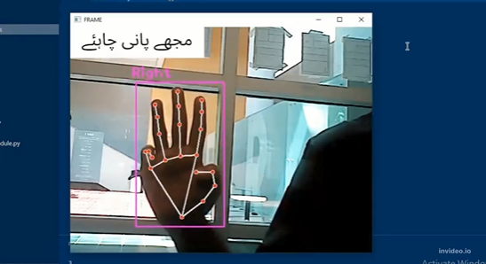

# HCI-ASSISTANCE_DEVICE
As our society continues to evolve, we must work to develop technologies that improve the lives of those who are most vulnerable. That's why we are making a vision-based assistance device designed specifically for elderly individuals, patients, and people with disabilities. This device utilizes cutting-edge computer vision technology to detect and interpret hand gestures, allowing users to communicate their needs more quickly and efficiently. Whether in a hospital bed, at home, or out in the community, they can use this device to convey their message to the nearest person for assistance.

By Following User Centered Design (UCD) approach, We are trying to find the basic five needs of our targeted user groups (Elderly People, Patients and Disabled People) that they use in their daily routine to convey their essential needs to take assistance.
